# Una breve historia de la visualización de datos 

Este resumen condensa ideas del libro *Handbook of Data Visualization* de Chen, Härdle y Unwin. [@book:265919] y de *A Brief History of Data Visualization* de Michael Friendly. [@friendly2008brief]

## Introducción

Comúnmente se pìensa  que los gráficos estadísticos y la visualización de datos son desarrollos relativamente modernos en la estadística. Sin embargo, la representación gráfica de la información cuantitativa tiene raíces profundas. Estas raíces llegan a la historia de las primeras cartografías y representaciones visuales, y más tarde a la cartografía temática, estadísticas y gráficos estadísticos, con aplicaciones e innovaciones en muchos campos de la medicina y la ciencia que a menudo se entrelazan entre sí. También se conectan con el aumento del pensamiento estadístico y la recopilación de datos generalizado para la planificación y el comercio hasta el siglo XIX. En el camino, una variedad de avances contribuyeron al uso generalizado de la visualización de datos en la actualidad. Estos incluyen tecnologías para dibujar y reproducir imágenes, avances en matemáticas y estadística, y nuevos desarrollos en la recolección de datos, observación empírica y grabación.

## Hitos

Al organizar esta historia, fue útil dividirla en épocas, cada una de las cuales resultó ser descriptible por temas y etiquetas coherentes. Esta división es, por supuesto, algo artificial, pero ofrece la oportunidad de caracterizar los logros en cada período de una manera general, antes de describir algunos de ellos con más detalle. La siguiente figura proporciona una visión general gráfica de las épocas que se describen en las siguientes subsecciones, abajo está la frecuencia de eventos considerados hitos en los periodos de esta historia. Por el momento, basta señalar las etiquetas adheridas a estas épocas, un constante aumento desde principios del siglo 18, con un curioso movimiento a partir de entonces.

En el panorama más amplio -reconociendo la historia de la visualización de datos- resulta que muchos de los ítems de los hitos tienen una historia que contar: ¿Qué motivó este desarrollo? ¿Cuál fue el objetivo de la comunicación? ¿Cómo se relaciona con otros desarrollos? ¿Cuáles fueron los precursores? ¿Cómo se ha utilizado o reinventado esta idea hoy? Cada sección trata de ilustrar los temas generales con algunos ejemplos. En particular, esta cuenta intenta relatar algunas historias representativas de estos períodos, en lugar de tratar de ser exhaustivas.

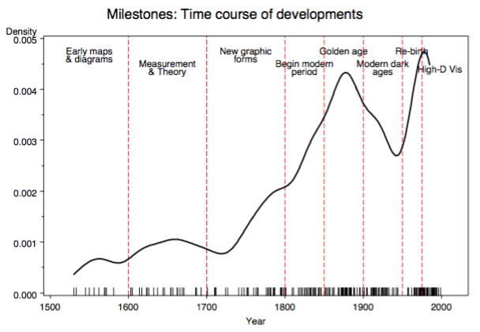

## Principios del siglo 17: Primeros mapas y diagramas

Las primeras semillas de la visualización surgieron en los diagramas geométricos, en las tablas de las posiciones de las estrellas y otros cuerpos celestes, y en la elaboración de mapas para ayudar en la navegación y la exploración. La idea de las coordenadas fue utilizada por los agrimensores egipcios antiguos en la disposición de las ciudades, las posiciones terrenales y celestiales se localizaron por algo similar a la latitud y la longitud al menos en el 200 a de C, y la proyección del mapa de una tierra esférica en latitud y longitud por Claudius Ptolemy [c. 85 - c. 165] en Alejandría serviría como referencia hasta el siglo XIV.

Entre las representaciones gráficas más tempranas de la información cuantitativa se encuentra un gráfico anónimo de la serie temporal del siglo X de la posición cambiante de los siete cuerpos celestes más prominentes sobre el espacio y el tiempo (Figura 2), descrito por Funkhouser (1936) y reproducido en Tufte (1983, página 28). El eje vertical representa la inclinación de las órbitas planetarias, el eje horizontal muestra el tiempo, dividido en treinta intervalos. Es notable la variación sinusoidal, con periodos diferentes, como es el uso de una rejilla, lo que sugiere una noción implícita de un sistema de coordenadas, y algo parecido al papel cuadriculado, ideas que no estarían completamente desarrolladas hasta 1600-1700.

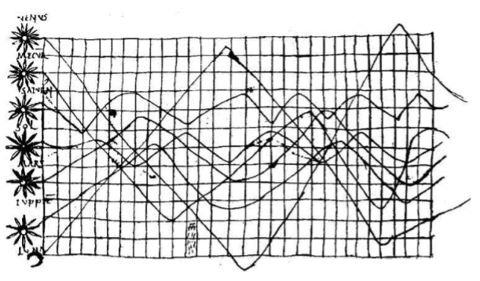

En el siglo XVI, las técnicas e instrumentos para la observación precisa y la medición de las cantidades físicas y la posición geográfica y celestial estaban bien desarrolladas (por ejemplo, un "cuadrante de la pared" construido por Tycho Brahe [1546-1601], cubriendo toda una pared en su observatorio). Particularmente importantes fueron el desarrollo de la triangulación y otros métodos para determinar con exactitud las localizaciones de mapas. Además, vemos ideas iniciales para capturar imágenes directamente (la cámara oscura, usada por Reginer Gemma-Frisius en 1545 para registrar un eclipse del sol), la grabación de funciones matemáticas en tablas (tablas trigonométricas de Georg Rheticus, 1550), y el primer atlas cartográfico moderno (*Teatrum Orbis Terrarum* de Abraham Ortelius, 1570). Estos primeros pasos comprenden los inicios de la visualización de los datos.

## 1600 - 1699: Medición y teoría

Entre los problemas más importantes del siglo XVII estaban los relacionados con la medición física del tiempo, la distancia y el espacio para la astronomía, la topografía, la elaboración de mapas, la navegación y la expansión territorial. En este siglo también se observó un nuevo crecimiento en la teoría y el amanecer de la aplicación práctica: el surgimiento de la geometría analítica y los sistemas de coordenadas (Descartes y Fermat), teorías de errores de medición y estimación (pasos iniciales de Galileo en el análisis de observaciones sobre la estrella de Tycho Brahe de 1572, el nacimiento de la teoría de la probabilidad (Pascal y Fermat) y los comienzos de las estadísticas demográficas (John Graunt) y la "aritmética política" (William Petty), La tierra, los impuestos, el valor de los bienes, etc. con el fin de comprender la riqueza del Estado.

A principios de este siglo, Christopher Scheiner (1630, grabaciones de 1611) introdujo una idea que Tufte (1983) llamaría más tarde el principio de "pequeños múltiplos" para mostrar las cambiantes configuraciones de las manchas solares a lo largo del tiempo (Figura 3). Las imágenes representan las grabaciones de manchas solares del 23 de octubre de 1611 hasta el 19 de diciembre de ese año. La clave grande en la parte superior izquierda identifica siete grupos de manchas solares por las letras A-F. Estos grupos se identifican de forma similar en las 37 imágenes más pequeñas, agrupadas de izquierda a derecha y de arriba a abajo.

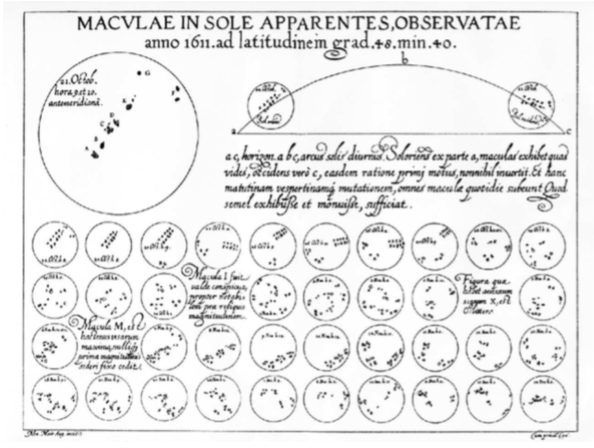

Otro ejemplo notable (Figura 4) muestra un gráfico de 1644 de Michael Florent van Langren [1600-1675], un astrónomo flamenco de la corte de España, que se cree es la primera representación visual de datos estadísticos (Tufte, 1997, p. 15). En ese momento, la falta de un medio fiable para determinar la longitud en el mar dificultaba la navegación y la exploración. Este gráfico de línea unidimensional muestra las 12 estimaciones conocidas de la diferencia de longitud entre Toledo y Roma, y el nombre del astrónomo (Mercator, Tycho Brahe, Ptolomeo, etc.) que proporcionó cada observación.

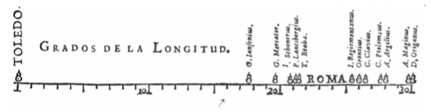

## 1700 - 1799: Nuevas formas gráficas

Con algunos rudimentos de teoría estadística, datos de interés e importancia, y la idea de representación gráfica por lo menos algo establecida, el siglo 18 fue testigo de la expansión de estos aspectos a nuevos dominios y nuevas formas gráficas. En la cartografía, los fabricantes de mapas empezaron a tratar de mostrar algo más que una simple posición geográfica en un mapa. Como resultado, se inventaron nuevas representaciones de datos (isolíneas y contornos), y la cartografía temática de las cantidades físicas se arraigó. Hacia finales de este siglo, se ven los primeros intentos de cartografía temática de datos geológicos, económicos y médicos.

Los gráficos abstractos y los gráficos de las funciones se hicieron más difundidos, junto con los comienzos tempranos de la teoría estadística (error de la medida) y la colección sistemática de datos empíricos. Cuando se empezaron a recolectar otros datos (económicos y políticos), se inventaron nuevas formas visuales para retratarlos, de modo que los datos podían «hablar a los ojos».

Por ejemplo, el uso de isolines para mostrar contornos de igual valor en una cuadrícula de coordenadas (mapas y gráficos) fue desarrollado por Edmund Halley (1701). La Figura 5, que muestra líneas isogónicas de declinación magnética igual está entre los primeros ejemplos de cartografía temática, superponiendo datos en un mapa. Los mapas de contorno y los mapas topográficos fueron introducidos un poco más tarde por Phillippe Buache (1752) y Marcellin du Carla-Boniface (1782).

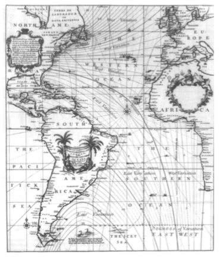

El uso de figuras geométricas (cuadrados o rectángulos) y cartogramas para comparar áreas o magnitudes demográficas por Charles de Fourcroy (1782) y August FW Crome (1785) proporcionó otra codificación visual novedosa para datos cuantitativos usando cuadrados superpuestos para comparar las áreas de Estados europeos.

También cabe resaltar la contribución del francés Charles Minard (1781 - 1870) a quien se debe su notable contribución en el campo de las gráficas informativas en ingeniería civil y estadística. Una de sus representaciones es la que se muestra en la figura 6.

## 1800 - 1850: Albores de las gráficas modernas

Con la fertilización proporcionada por las innovaciones anteriores de diseño y técnica, la primera mitad del siglo 19 fue testigo de un crecimiento explosivo en gráficos estadísticos y cartografía temática, a un ritmo que no se igualaría hasta los tiempos modernos.

En los gráficos estadísticos, se inventaron todas las formas modernas de visualización de datos: diagramas de barras y sectores, histogramas, gráficos de líneas y gráficos de series temporales, gráficos de contornos, diagramas de dispersión, etc. En la cartografía temática, la cartografía pasó de mapas únicos a atlas completos, describiendo datos sobre una amplia variedad de temas (económicos, sociales, morales, médicos, físicos, etc.) e introdujo una amplia gama de nuevas formas de simbolismo. Durante este período, también aparecieron regularmente en las publicaciones científicas análisis gráficos de fenómenos naturales y físicos (líneas de magnetismo, meteorología, mareas, etc.).

En octubre de 1831, el primer caso de cólera asiático se produjo en Gran Bretaña, y más de 52.000 personas murieron en la epidemia que se produjo durante los siguientes 18 meses aproximadamente. Las epidemias subsiguientes de cólera en 1848-1849 y 1853-1854 produjeron peores muertes similares, pero la causa de la enfermedad fue desconocida hasta 1855 cuando el Dr. John Snow produjo su famoso mapa de puntos mostrando muertes debidas al cólera agrupado alrededor de la bomba de Broad Street en Londres. Este fue, de hecho, un descubrimiento gráfico, pero ocurrió al final del período, aproximadamente 1835-1855, lo que marca un punto culminante en la aplicación de la cartografía temática a los temas humanos (sociales, médicos, étnicos). El primer mapa conocido de enfermedad del cólera (Figura 7), debido al Dr. Robert Baker (1833), muestra los distritos de Leeds "afectados por el cólera" en el particularmente grave brote de 1832.

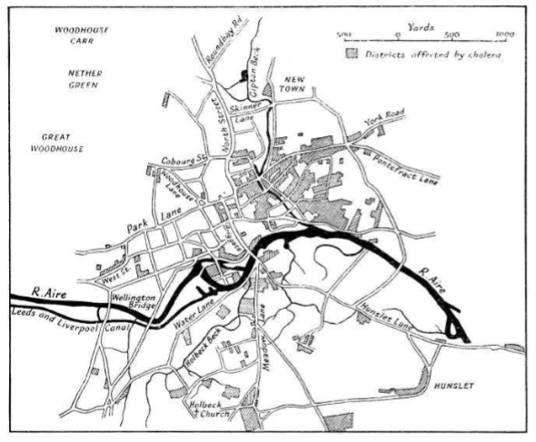

Aproximadamente al mismo tiempo, ~1830-1850, el uso de gráficos comenzó a ser reconocido en algunos círculos oficiales para la planificación económica y estatal: ¿donde construir ferrocarriles y canales? ¿Cuál es la distribución de las importaciones y las exportaciones? Este uso de los métodos gráficos no estuvo mejor ilustrado que en las obras de Charles Joseph Minard [1781-1870], cuyas prodigiosas invenciones gráficas llevaron a Funkhouser (1937) a llamarlo el Playfair de Francia. Para ilustrar, se eligió (con cierta dificultad) un "tableau-gráfico" de 1844 (Figura 8) de Minard, un progenitor temprano del mosaico moderno. En la superficie, las parcelas de mosaico descienden de los gráficos de barras, pero Minard introdujo dos innovaciones simultáneas: el uso de barras divididas y de anchura proporcional para que el área tuviera una interpretación visual concreta. El gráfico muestra el transporte de mercancías comerciales a lo largo de una ruta de canal en Francia por barras divididas de anchura variable.

En esta imagen la anchura de cada barra vertical muestra la distancia a lo largo de esta ruta; Los segmentos de barra divididos tienen una cantidad de bienes de varios tipos (mostrada por sombreado), de manera que el área de cada segmento rectangular es proporcional al coste de transporte.

## 1850 - 1900: El era dorada de las gráficas estadísticas

A mediados del siglo XIX, se habían establecido todas las condiciones para el rápido crecimiento de la visualización, una "tormenta perfecta" para los gráficos de datos. En toda Europa se establecieron oficinas estatales oficiales de estadística, en reconocimiento de la creciente importancia de la información numérica para la planificación social, la industrialización, el comercio y el transporte. La teoría estadística, iniciada por Gauss y Laplace, y extendida al ámbito social por Guerry y Quetelet, proporcionó los medios para dar sentido a grandes conjuntos de datos.

Las escalas y las formas de gráficos y mapas también se transformaron para una variedad de propósitos, dando lugar a gráficos semi-logarítmicos para mostrar el cambio porcentual en las mercancías en el tiempo, gráficos log-log para mostrar relaciones multiplicativas, mapas anamórficos por E mile Cheysson, utilizando deformaciones de tamaño espacial para mostrar una variable cuantitativa (por ejemplo, la disminución en el tiempo para viajar de París a varios lugares en Francia más de 200 años) y diagramas de alineación o Nomogramas utilizando conjuntos de ejes paralelos. Se ilustra esta parte de la edad de oro con la figura 9, un gráfico de tour-de-force para la determinación de la desviación magnética en el mar en relación con la latitud y longitud sin cálculo ("L'Abaque Triomphe") por Charles Lallemand (1885), director General de la medición geodésica de altitudes en toda Francia, que combina muchas variables en un nomograma multifuncional, utilizando 3D, yuxtaposición de mapas anamórficos, coordenadas paralelas y cuadrículas hexagonales.

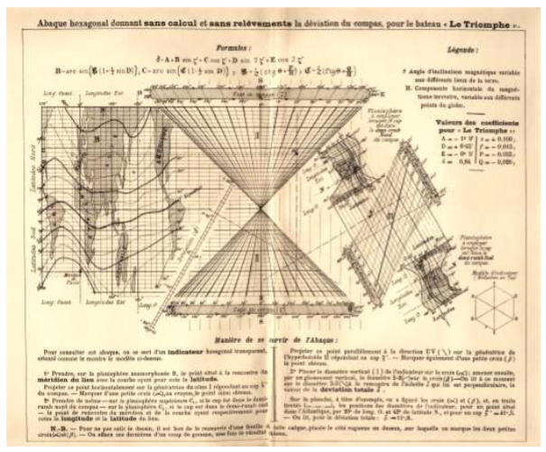

En 1859, Florence Nightingale usa estadísticas de víctimas de la guerra de Crimea para influenciar a la opinión pública y a la Oficina de Guerra. Ella muestra víctimas mes a mes en un gráfico circular diseñado por ella, la “rosa de Nightingale”, precursor del gráfico de torta. Ella es la primera mujer miembro de la Sociedad Real de Estadística y la primer miembro extranjera de la Asociación Americana de Estadística.

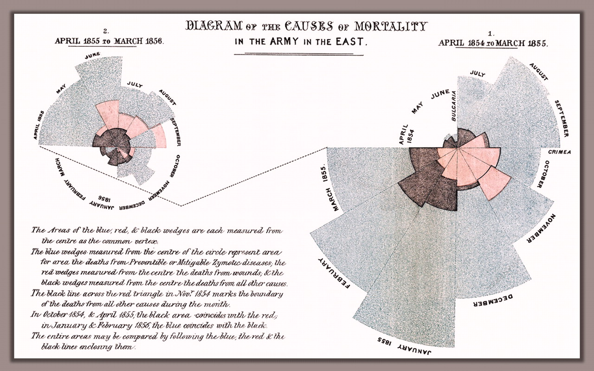

El descubrimiento gráfico no estadístico más notable de Francis Galton (1822-1911) fue el del modelo "anticiclónico" (en sentido contrario a las agujas del reloj) de vientos alrededor de regiones de baja presión, combinado con rotaciones en el sentido de las agujas del reloj alrededor de zonas de alta presión. El trabajo de Galton sobre patrones climáticos comenzó en 1861 y fue resumido en *Meteorographica* (1863). Contiene una variedad de ingeniosos gráficos y mapas (más de 600 ilustraciones en total), uno de los cuales se muestra en la Figura 10. Este notable gráfico, uno de una pantalla de dos páginas en forma de enrejado, muestra observaciones sobre la presión barométrica, dirección del viento, lluvia y temperatura a partir de 15 días en diciembre de 1861. Para cada día, la cuadrícula 3 × 3 muestra mapas esquemáticos de Europa, presión cartográfica (fila 1), viento y lluvia (fila 2) y temperatura (fila 3), por la mañana, tarde y noche (columnas). Se puede observar claramente la serie de áreas negras (baja presión) en las tablas barométricas durante la primera mitad del mes, correspondientes a las flechas en el sentido contrario a las agujas del reloj en las cartas de viento, seguido por un cambio a áreas rojas (alta presión ) y más flechas en el sentido de las agujas del reloj. 

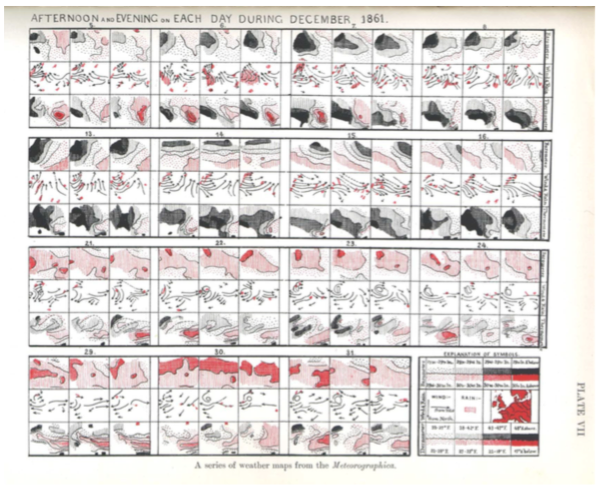

El pináculo de este período de álbumes estadísticos patrocinados por el Estado es, sin duda, los *Albums de Statistique Graphique* publicados anualmente por el ministerio francés de obras públicas desde 1879-1897 bajo la dirección de E mile Cheysson.

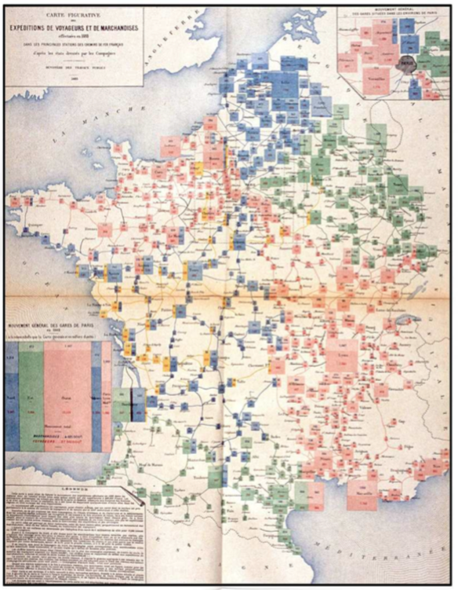

1900 - 1950: El oscurantismo moderno

Si a finales del siglo XIX se trataba de la "edad de oro" de los gráficos estadísticos y la cartografía temática, los 1900s tempranos puede ser llamados el "oscurantismo moderno" de la visualización.

Hubo pocas innovaciones gráficas y, a mediados de la década de 1930, el entusiasmo por la visualización que caracterizó a finales del siglo XIX había sido suplantado por el aumento de la cuantificación y por modelos formales, a menudo estadísticos, en las ciencias sociales. Los números, las estimaciones de los parámetros y, especialmente, los errores estándar fueron precisos. Las imágenes eran, bueno, sólo cuadros: bonitos o evocadores, tal vez, pero incapaces de indicar un "hecho" a tres o más decimales. O eso le pareció a muchos estadísticos.

Sir Arthur Bowley representó el valor total de las exportaciones de Gran Bretaña e Irlanda entre 1855 y 1899. Se discutió si las exportaciones se habían vuelto estacionarias en los últimos años y la conclusión de Sir Robert Giffen (1899), basada exclusivamente en las tablas de promedios de cinco mencionó que "el único signo de estacionariedad es un aumento a un ritmo menor en los últimos períodos que en los períodos anteriores". Para responder a esto, representó los datos brutos, junto con las curvas de la media móvil en tres, cinco y diez años. Los promedios móviles de tres y cinco años muestran fuertes evidencias de un ciclo de aproximadamente 10 años, y señaló que "no puede sostenerse ningún argumento que no tenga en cuenta el ciclo del comercio, que no se elimina hasta que se adopten los promedios decenales". Para ello, tomó promedios de períodos sucesivos de 10 años a partir de 1859 y dibujó una curva a mano alzada "manteniéndose lo más cerca posible de los puntos, sin hacer cambios repentinos en la curvatura", dando la curva gruesa en la figura 12. La conclusión de Robert y la evidencia de un ciclo de 10 años debe mucho a este tratamiento gráfico.

## 1950 - 1975: Renacimiento de la visualización de datos

Todavía bajo la influencia del *zeitgeist* formal y numérico de mediados de los años 30 encendido, la visualización de los datos comenzó a levantarse de la latencia en los mediados de los años 60. Esto fue impulsado en gran parte por tres desarrollos significativos:

* En Estados Unidos, John W. Tukey [1915-2000], en un documento de referencia, *El Futuro de la Análisis de Datos*, hizo un llamamiento para el reconocimiento del análisis de datos como una rama legítima de la estadística distinta de la Estadística matemática; En breve, comenzó la invención de una amplia variedad de formas gráficas nuevas, simples y eficaces, bajo el rótulo de "Exploratory Data Analysis" (EDA) - gráficos de tallo-hoja, diagramas de cajas, raíces colgantes, pantallas de dos vías y etc., muchos de los cuales entraron en el vocabulario estadístico y en la implementación del software. La estatura de Tukey como estadístico y el alcance de su enfoque informal, robusto y gráfico para el análisis de datos fueron tan influyentes como sus innovaciones gráficas. Aunque no se publicó hasta 1977, los capítulos del libro de Tukey EDA (Tukey, 1977) se distribuyeron ampliamente cuando comenzaron a aparecer en 1970-1972, y comenzaron a hacer el análisis gráfico de datos interesante y respetable otra vez.

* En Francia, Jacques Bertin [1918-] publicó la monumental *Semiologie Graphique* (Bertin, 1967). Para algunos, esto parecía hacer para los gráficos lo que Mendeleev había hecho para la organización de los elementos químicos, es decir, organizar los elementos visuales y perceptuales de los gráficos de acuerdo con las características y las relaciones en los datos. En un vapor paralelo pero separado, un enfoque exploratorio y gráfico de datos multidimensionales ("*L'analyse des donnees*") iniciado por Jean-Paul Benzécri [1932-] proporcionó a los estadísticos franceses y otros estadísticos europeos una alternativa, visualmente basada en lo que la estadística se trata.

* Pero las habilidades de mapas y gráficos dibujados a mano se habían marchitado durante el "oscurantismo" de los gráficos (aunque casi todas las figuras de la EDA de Tukey fueron dibujadas a mano por intención). El procesamiento informático de datos estadísticos comenzó en 1957 con la creación de FORTRAN, el primer lenguaje de alto nivel para la informática. A finales de la década de 1960, las computadoras universales generalizadas de computadoras centrales ofrecían la posibilidad de construir viejas y nuevas formas gráficas mediante programas informáticos. Las aplicaciones estadísticas interactivas y los verdaderos gráficos de alta resolución se desarrollaron pero tomarían un tiempo para entrar en el uso común.

Al final de este período, empezarían las intersecciones y colaboraciones significativas: (a) investigación de la ciencia informática (herramientas de software, lenguaje C, UNIX, etc.) en Bell Laboratories y en otros lugares combinaría fuerzas con (b) Desarrollos en el análisis de datos (EDA, psicometría, etc.) y (c) tecnología de visualización y entrada (plotters, terminales gráficos, tabletas digitalizadoras, ratón, etc.). Estos desarrollos proporcionarán nuevos paradigmas, lenguajes y paquetes de software para expresar ideas estadísticas e implementar gráficos de datos. A su vez, conducirían a un crecimiento explosivo en nuevos métodos y técnicas de visualización.

## 1975 - presente: visualización de datos interactiva y dinámica

Durante el último cuarto del siglo XX, la visualización de datos se ha convertido en un área de investigación madura, vibrante y multidisciplinar, como se puede ver en este Manual @book:265919, y herramientas de software para una amplia gama de métodos de visualización y tipos de datos están disponibles para cada computadora. Sin embargo, es difícil proporcionar una visión suscinta de los desarrollos más recientes en la visualización de datos, porque son tan variados, se han producido a un ritmo acelerado y en un rango más amplio de disciplinas. También es muy difícil destacar los acontecimientos más significativos, que pueden ser vistos como tales en una historia posterior centrada en este período reciente.

Con este descargo de responsabilidad, se destacan algunos temas importantes:

* el desarrollo de sistemas informáticos estadísticos altamente interactivos. Inicialmente, esto significó en gran medida que fuesen controlados por comandos, los sistemas directamente programables (APL, S), en contraposición a la compilación, al procesamiento por lotes;

* nuevos paradigmas de manipulación directa para el análisis de datos visuales (vinculación, cepillado, selección, enfoque, etc.);

* nuevos métodos para la visualización de datos de gran dimensión (el tour grande (Asimov, 1985), la matriz del diagrama de dispersión (Tukey y Tukey, 1981), el diagrama de coordenadas paralelas (Inselberg, 1985, Wegman, 1990), los diagramas de extensión (Young, 1994a).);

* la invención (o reinvención) de técnicas gráficas para datos discretos y categóricos;

* la aplicación de métodos de visualización a una serie cada vez más amplia de problemas sustantivos y estructuras de datos, y

* la atención considerablemente mayor a los aspectos cognitivos y perceptivos de la visualización de datos.

Esta evolución de los métodos y técnicas de visualización probablemente dependía de los avances en la infraestructura teórica y tecnológica, tal vez más que en períodos anteriores.

Algunos de estos son:

* ingeniería de software estadístico y gráfico a gran escala, tanto comercial (por ejemplo, SAS) como no comercial (por ejemplo, Lisp-Stat, R). Estos han sido a menudo significativamente apalancados por los estándares de código abierto para la presentación de la información y la interacción (por ejemplo, Java, Tcl/Tk);

* Extensiones del modelado estadístico lineal clásico a dominios cada vez más amplios (modelos lineales generalizados, modelos mixtos, modelos para datos espaciales / geográficos, etc.).

* Aumento considerable de la velocidad y capacidad de procesamiento de la computadora, permitiendo métodos computacionales intensivos (métodos bootstrap, análisis Bayesiano MCMC, etc.), acceso a problemas masivos de datos (medidos en terabytes) y datos en tiempo real. Los avances en esta área continúan presionando para nuevos métodos de visualización.

Desde principios de los años setenta hasta mediados de los ochenta, muchos de los avances en gráficos estadísticos se referían a gráficos estáticos para datos cuantitativos multidimensionales, diseñados para permitir al analista ver relaciones en dimensiones progresivamente más altas. Las ideas más antiguas de técnicas de reducción de dimensiones (análisis de componentes principales, escalamiento multidimensional, análisis discriminante, etc.) dieron lugar a generalizaciones de proyectar un conjunto de datos de altas dimensiones a vistas "interesantes" de bajas dimensiones, expresadas por varios índices numéricos que podrían ser pptimizado (persecución por proyección) o explorado interactivamente (gran recorrido).

El desarrollo de métodos generales para tablas multidimensionales de contingencia comenzó a principios de los años 70, con Leo Goodman (1970), Shelly Haberman (1973) y otros (Bishop et al., 1975) exponiendo los fundamentos de los modelos log-lineales. A mediados de los años ochenta, se desarrollaron algunas técnicas iniciales especializadas para visualizar tales datos (diagrama cuadriplicados (Fienberg, 1975), diagrama de asociación (Cohen, 1980), diagrama de mosaico (Hartigan y Kleiner, 1981) y diagrama de tamiz (Riedwyl y Schu ̈pbach, 1983)), basado en la idea de mostrar frecuencias por área (Friendly, 1995). De éstas, las extensiones del mosaico (Friendly, 1994, 1999) han demostrado ser de utilidad general, y ahora están ampliamente implementadas en una variedad de software estadístico, más completamente en el paquete vcd (Meyer et al., 2005) de R.

Se puede argumentar que el mayor potencial para el crecimiento reciente en la visualización de datos provino del desarrollo de métodos gráficos dinámicos, permitiendo la manipulación instantánea y directa de objetos gráficos y propiedades estadísticas relacionadas. Una instancia temprana fue un sistema para interactuar con tramas de probabilidad (Fowlkes, 1969) en tiempo real, eligiendo un parámetro de forma de una distribución de referencia y transformaciones de potencia ajustando un control. El primer sistema general para la manipulación de datos de gran dimensión fue PRIM-9, desarrollado por Fishkeller, Friedman y Tukey (1974), y proporcionando herramientas dinámicas para Proyectar, Rotar (en 3D), Aislar (identificar subconjuntos) y Enmascarar datos en hasta 9 dimensiones. A mediados de los años ochenta, a medida que las estaciones de trabajo y la tecnología de pantalla se volvieron más baratas y más potentes, el software de escritorio para gráficos dinámicos se hizo más accesible (por ejemplo, MacSpin, Xgobi). Muchos de estos desarrollos hasta ese momento se detallan en los capítulos de Dynamic Graphics for Statistics (Cleveland y McGill, 1988)

En los años noventa, varias de estas ideas fueron reunidas para proporcionar sistemas más generales para gráficos dinámicos e interactivos, combinados con la manipulación y análisis de datos en ambientes computacionales coherentes y extensibles. La combinación de todos estos factores era más poderosa e influyente que la suma de sus partes. Por ejemplo, Lisp-Stat (Tierney, 1990) y su progenie (Arc, Cook y Weisberg (1999), ViSta, Young (1994b)) proporcionaron un entorno orientado a objetos fácilmente extensible para la informática estadística. En estos sistemas, los widgets (deslizadores, cuadros de selección, listas de selección, etc.), gráficos, tablas, modelos estadísticos y el usuario, todos comunicados a través de mensajes, actuados por quien era un "oyente" designado y tenían un método para responder a la mayoría de las ideas y métodos detrás de los gráficos interactivos actuales que se describen e ilustran en Young et al. (2006). 

# Línea de tiempo de la Estadística

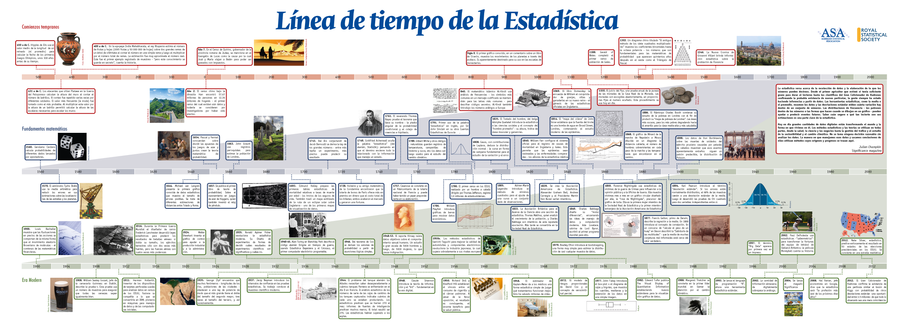
