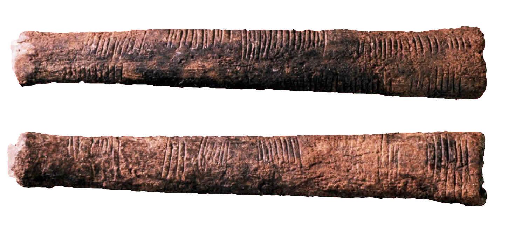
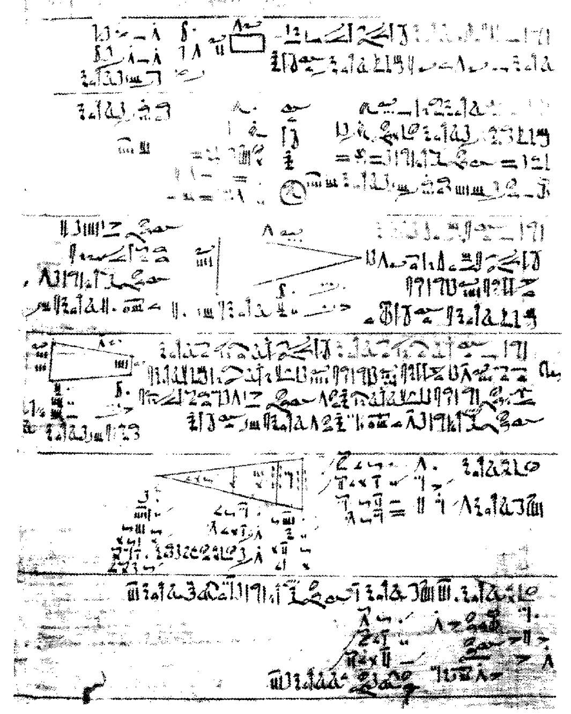

# Antecedentes históricos de concepto de número

Este texto no se elaboró siguiendo una pesquisa minuciosa sino que se construyó con base en lo encontrado principalmente en @santiago2011resumenes.

Intuitivamente el concepto de número se asocia con la habilidad de contar y comparar la cantidad de elementos entre dos conjuntos de objetos similares. Las primeras civilizaciones debieron determinar comparaciones entre conjuntos o de conocer cuántos elementos formaban una colección de cosas.

El conteo se inició mediante la utilización de objetos físicos que el ser humano encontraba a su alrededor (huesos, palos, piedras, etc.) como el de Lebombo con 29 muescas grabadas en un hueso de babuino que tiene cerca de 37000 años de antigüedad [@stewart2008historia]

Los sistemas de numeración de muchas de las familias lingüísticas hablan acerca de que el conteo estuvo asociado a los dedos, situación por la que los sistemas de base decimal y vigesimal se impusieron.

La transición hacia símbolos numerales se justifica en la organización gubernamental y su origen estaría en primitivas figuras que servían para el recuento de diferentes bienes como los encontrados en Mesopotamia, iscritos en tablillas de arcilla. Los símbolos numéricos mesopotámicos son los más antiguos y muchos de ellos no se usaron exclusivamente para la contabilidad o el comercio sino para la agrimensura o la astronomía [@verdejo1851guia].

Desde hace 5000 años la mayoría de civilizaciones cuentan como lo hacemos hoy en día, es decir, como una representación de los números naturales. Sin embargo pueden caracterizarse en tres categorías:

1. **Notación aditiva**. Acumulan los símbolos de todas las unidades, decenas, centenas, etc. necesarios hasta completar el número. De este tipo son los sistemas egipcio, hitita, romano, griego, armenio, judío, etc.

2. **Notación híbrida**. Combinan el principio aditivo con el multiplicativo. Por ejemplo, en el sistema de notación aditiva 500 se representa con cinco símbolos de cien. En éstos se utiliza la combinación del cinco y el cien. De este tipo son: chino clásico, asirio, armenio, etíope y maya. El sistema de numeración maya usó símbolos para el "1", "5" y "0", siendo éste el primer uso documentado del cero (año 36 a de C).

3. **Notación posicional**. La posición de las cifras indica si son unidades, decenas, centenas, o en general la potencia de la base. Tres culturas junto con la india lograron desarrollar un sistema así: El sistema *Chino* (300 a de C) que no disponía de "0"", el sistema *Babilónico* (2000 a de C) con dos símbolos, de base 10 aditivo hasta el 60 y posicional (de base 60) en adelante, sin "0" hasta el 300 a de C.

## Papiro Ahmes/Rhind y las fracciones egipcias

Este papiro data del 2000 al 1800 a de C considera las fracciones unitarias (inversas de los naturales 1/20) que se representan con un signo oval encima del número, la fracción 2/3 que se representa con un signo especial y en algunos casos fracciones del tipo $ n / n + 1$. Hay tablas de descomposición de $2 / n$ desde n=1 hasta n=101, por ejemplo $2 / 5 = 1 / 3 + 1 / 15$  ó $2 / 7 = 1 / 4 + 1 / 28$.

## Documentos cuneiformes

En las tablillas cuneiformes de la dinastía Hammurabi (1800-1600 a de C) aparece el sistema posicional, antes referido, extendido a las fracciones.

Para calcular recurrían, como nosotros antes de disponer de máquinas, a las numerosas tablas de que disponían: De multiplicar, de inversos, de cuadrados y cubos, de raíces cuadradas y cúbicas, de potencias sucesivas de un número dado no fijó, etc.

## Cero

Sobre el siglo III a de C, en Grecia, se comenzó a representar la nada mediante una "o" que significa oudos 'vacío', y que no dio origen al concepto de cero como existe hoy en día. La idea del cero como concepto matemático parece haber surgido en la India mucho antes que en ningún otro lugar. La única notación ordinal del viejo mundo fue la sumeria, donde el cero se representaba por un vacío.

En América, la primera expresión conocida del sistema de numeración vigesimal prehispánico data del siglo III a de C. Se trata de una estela olmeca tardía, la cual ya contaba tanto con el concepto de "orden" como el de "cero". Los mayas inventaron cuatro signos para el cero; los principales eran: el corte de un caracol para el cero matemático, y una flor para el cero calendárico (que implicaba, no la ausencia de cantidad, sino el cumplimiento de un ciclo).

## Sistema indo - arábigo en Occidente

Numerosos autores del siglo XIII contribuyeron a esta transmisión, entre los que se destacan: Alexandre de Villedieu (1225), Sacrobosco (*circa* 1195, o 1200-1256) y sobre todo Leonardo de Pisa (1180-1250). Este último, conocido como *Fibonacci*, quien viajó por Oriente y aprendió de los árabes el sistema posicional hindú. Escribió un libro, El *Liber abaci*, que trata en el capítulo I sobre la numeración posicional, en los cuatro siguientes las operaciones elementales, en los capítulos VI y VII las fracciones: comunes, sexagesimales y unitarias (¡no usa los decimales, principal ventaja del sistema!), y en el capítulo XIV los radicales cuadrados y cúbicos.

No aparecen los números negativos, que tampoco consideraron los árabes, debido a la identificación de número con magnitud (¡obstáculo que duraría siglos!). A pesar de la ventaja de sus algoritmos de cálculo, se desataría por diversas causas una lucha encarnizada entre abacistas y algoristas, hasta el triunfo final de estos últimos.

## Particularidades sociales de los números

* Los números naturales nacen por la necesidad de contar

* Los números fraccionarios por la necesidad de medir partes de un todo, y compartir

* Los enteros negativos por fenómenos de doble sentido: izquierda-derecha, arriba-abajo, pérdida-ganancia

* Los números reales por la necesidad de medir segmentos

* Los números complejos por exigencias de resolver ecuaciones algebráicas
